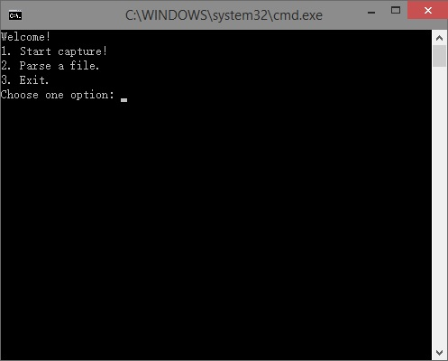
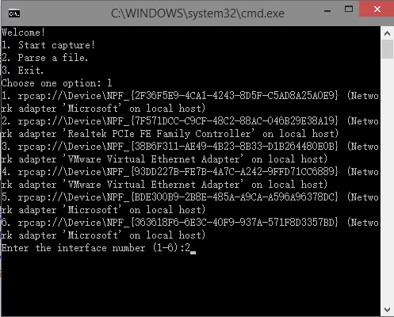
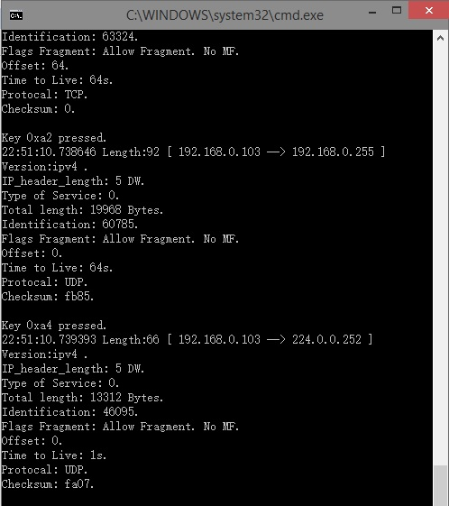
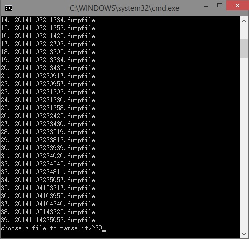

# netcapture
Simple IPv4 ip package capture program

This project is for my course "Computer Network" when I was in sophomore


This project used the Windows OS platform, used pcap API provided by WinPcap to do IP packet capture and analysis. Using C++ programming language with Visual Studio 2013 ultimate you need to configure something in the Visual Studio project properties to correct using the pcap API:

In configuration property -> C/C++ -> General: "additional include directories", inlcude pcap SDK include directory.

In configuration property -> C/C++ -> preprocessor: "preprocessor definitions", add "WPCAP" and "HAVE_REMOTE"

In configuration property -> C/C++ -> command line: add "/D _CRT_SECURE_NO_WARNINGS".

In configuration property -> linkers -> General: "additional library directories", include pcap SDK's lib directory.

In main cpp file of the program you need to add two lines of macro definitions (specifying the linker to link the external library):

```c
#pragma comment(lib,"wpcap.lib")
#pragma comment(lib,"ws2_32.lib")
```




